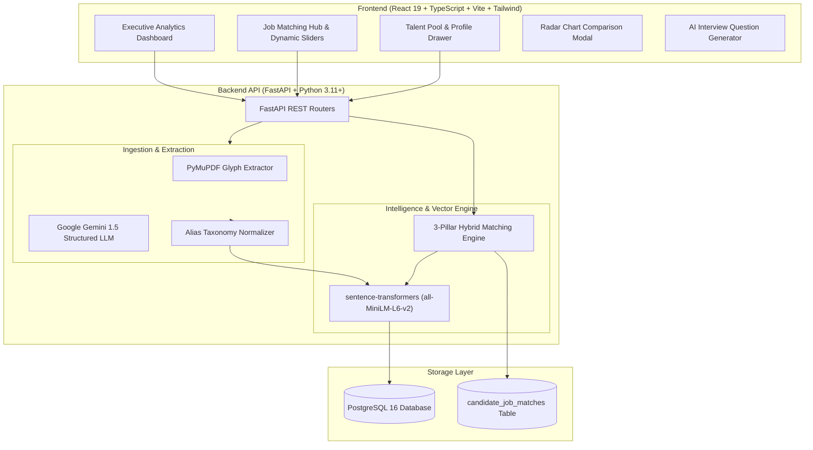

# TalentIQ AI – Recruitment Intelligence Platform

> **An End-to-End AI-Augmented Recruitment Platform combining Large Language Model Entity Extraction, Sentence-Transformer Dense Embeddings, and an Explainable 3-Pillar Hybrid Matching Engine.**

[](https://fastapi.tiangolo.com)
[](https://react.dev)
[](https://www.typescriptlang.org)
[](https://www.postgresql.org)
[](https://www.docker.com)
[](https://www.sydney.edu.au/)
[](LICENSE)

---

## 📌 Executive Summary

Traditional Applicant Tracking Systems (ATS) rely on brittle keyword search that frequently rejects qualified candidates due to synonym mismatches (e.g., `"NLP"` vs. `"Natural Language Processing"`). 

**TalentIQ AI** solves this through a **hybrid multi-factor intelligence engine** combining:
1. **Deterministic & Generative PDF Extraction**: Font glyph normalization + Google Gemini 1.5 structured entity extraction.
2. **Alias-Aware Skill Normalization**: Comprehensive taxonomy mapping covering 60+ technical skill variations, hyphenations, and acronyms.
3. **Dense Vector Semantics**: 384-dimensional cosine similarity via local `sentence-transformers` (`all-MiniLM-L6-v2`).
4. **Human-In-The-Loop Recruiter Tuning**: Live dynamic weight adjustments, side-by-side radar chart comparisons, and automated AI interview screening question generation.

---

## 📐 Mathematical Formulation & Scoring Engine

Each candidate-to-job compatibility evaluation is computed across three independent pillars:

$$\text{Overall Fit} = (w_{\text{skill}} \times S_{\text{skill}}) + (w_{\text{exp}} \times S_{\text{exp}}) + (w_{\text{sem}} \times S_{\text{sem}})$$

$$\text{Default Weights}: \quad w_{\text{skill}} = 0.40, \quad w_{\text{exp}} = 0.20, \quad w_{\text{sem}} = 0.40$$

### 1. Skill Fit Score

$$
\mathcal{S}_{\text{candidate}} =
\mathrm{parse\_skills}(\mathrm{candidate.skills})
$$

$$
\mathcal{S}_{\text{job}} =
\mathrm{parse\_skills}(\mathrm{job.required\_skills})
$$

$$
S_{\text{skill}} =
\frac{
\left|
\mathcal{S}_{\text{candidate}}
\cap
\mathcal{S}_{\text{job}}
\right|
}{
\left|
\mathcal{S}_{\text{job}}
\right|
}
\times 100\%
$$

### 2. Experience Compatibility ($S_{\text{exp}}$)
$$S_{\text{exp}} = \min\left(100, \frac{\text{Years}_{\text{candidate}}}{\text{MinYears}_{\text{job}}} \times 100\right)$$

### 3. Semantic Similarity Score ($S_{\text{sem}}$)
$$S_{\text{sem}} = \max\left(0, \frac{\mathbf{u}_{\text{candidate}} \cdot \mathbf{v}_{\text{job}}}{\|\mathbf{u}_{\text{candidate}}\| \|\mathbf{v}_{\text{job}}\|}\right) \times 100\%$$

---

## 🏗️ System Architecture



---

## 🌟 Key Application Features

### 1. 📊 Executive Analytics Dashboard
- **Live Talent Metrics**: Real-time KPI cards tracking candidate volume, open roles, and high-fit ratio ($\ge 70\%$).
- **Recharts Data Visualizations**:
  - *Skill Distribution*: In-demand technical competencies across candidate profiles.
  - *Match Quality Breakdown*: Donut chart illustrating Excellent, Strong, Moderate, and Weak match proportions.

### 2. 🎛️ Human-in-the-Loop Dynamic Weight Tuning
- Recruiter controls to slide **Skill Weight**, **Experience Weight**, and **Semantic Weight** in real-time.
- Candidates re-order and re-rank live without making additional network roundtrips.

### 3. 📊 Side-by-Side Radar Candidate Comparison
- Multi-axis comparison polygon plotting **Skill Fit**, **Experience Compatibility**, **Semantic Similarity**, and **Overall Rating** for up to 3 candidates simultaneously.
- Direct side-by-side matched vs. missing skills matrix.

### 4. 🤖 AI-Powered Interview Screening Generator
- Automatically generates 3 targeted technical interview questions targeting candidate skill gaps and missing proficiencies.
- Includes interviewer evaluation criteria and suggested model answers.

### 5. 👥 Talent Pool & Candidate Profile Drawer
- Categorized skill tags with overflow count badges.
- Seniority badges (`Junior/Grad`, `Mid-Level`, `Senior`).
- Deep inspection drawer rendering full parsed resume content, contact data, and 1-click matching.

---

## 🛠️ Tech Stack

| Layer | Technologies |
|---|---|
| **Frontend** | React 19, TypeScript, Vite, Tailwind CSS, Recharts, Lucide React, Axios, React Router v7 |
| **Backend** | FastAPI, Python 3.11, Pydantic v2, SQLAlchemy 2.0, Alembic, Uvicorn |
| **AI / NLP** | Google Gemini API (`google-genai`), Sentence-Transformers (`all-MiniLM-L6-v2`), PyMuPDF, PyPDF, NumPy |
| **Database** | PostgreSQL 16 (psycopg3 binary driver) |
| **DevOps** | Docker, Docker Compose, GitHub Actions CI/CD |

---

## 🚀 Quickstart & Installation

### Option 1: Docker Compose (Recommended)

```bash
# 1. Clone repository
git clone https://github.com/KumarDhananjaya/talentiq-ai.git
cd talentiq-ai

# 2. Setup backend environment variables
cp backend/.env.example backend/.env
# Add your GEMINI_API_KEY in backend/.env

# 3. Launch full stack
docker compose up --build
```

- **Frontend Application**: `http://localhost:5173`
- **Interactive API Docs (Swagger UI)**: `http://localhost:8000/docs`
- **PostgreSQL Database**: `localhost:5433`

---

### Option 2: Local Development Setup

#### Backend Setup
```bash
cd backend
python3 -m venv .venv
source .venv/bin/activate

pip install --upgrade pip
pip install -r requirements.txt

# Run migrations
alembic upgrade head

# Start API Server
uvicorn app.main:app --reload --host 0.0.0.0 --port 8000
```

#### Frontend Setup
```bash
cd frontend
npm install
npm run dev
```

---

## 🧪 Automated Testing

The project includes **49 comprehensive unit & integration tests** covering skill parsing, alias resolution, semantic vectors, and API endpoints:

```bash
cd backend
pytest scripts/test_skill_matching.py scripts/test_matching_service.py scripts/test_profile_text_service.py -v
```

```
scripts/test_skill_matching.py::test_alex_johnson_skill_match PASSED        [80%]
scripts/test_skill_matching.py::test_sarah_williams_skill_match PASSED      [60%]
scripts/test_skill_matching.py::test_alias_matching_llms PASSED             [100%]
============================== 49 passed in 0.08s ==============================
```

---

## 👨‍💻 Author

**Kumar Dhananjaya**  
*Student, The University of Sydney (USYD)*  
- GitHub: [@KumarDhananjaya](https://github.com/KumarDhananjaya)
- Project Repository: [talentiq-ai](https://github.com/KumarDhananjaya/talentiq-ai)

---

## 📄 License

This project is open-source software licensed under the [MIT License](LICENSE).

